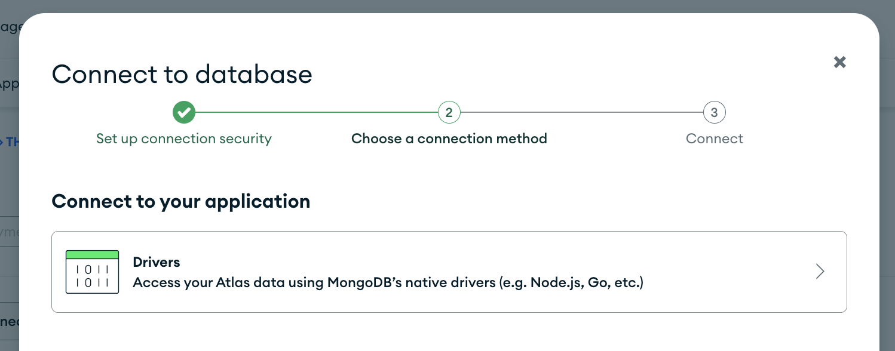
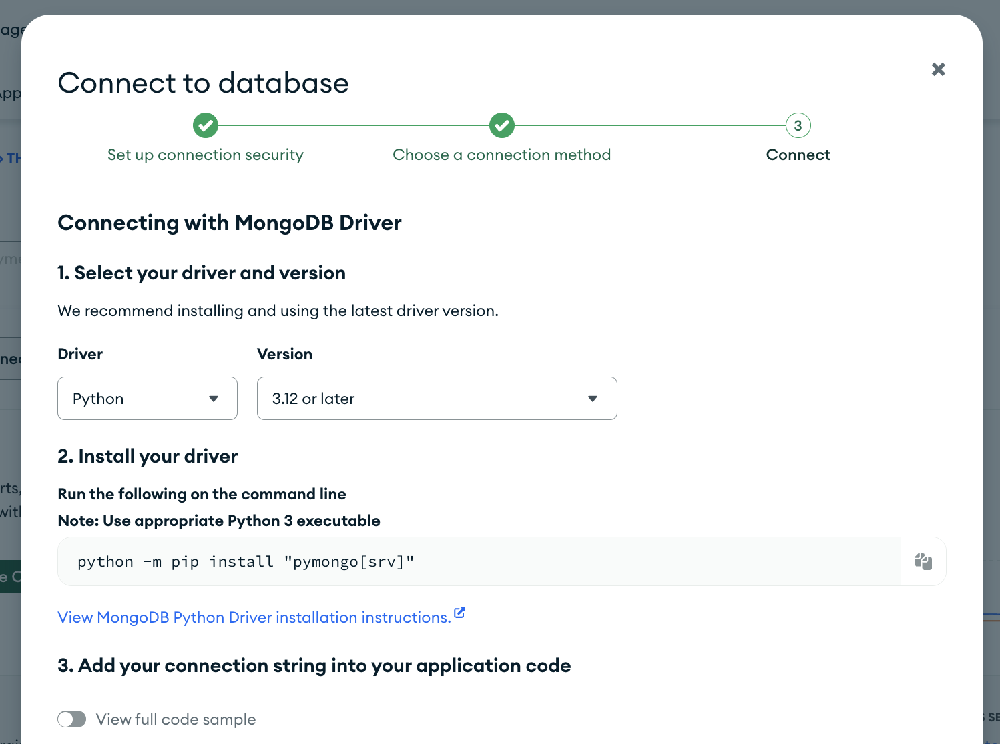
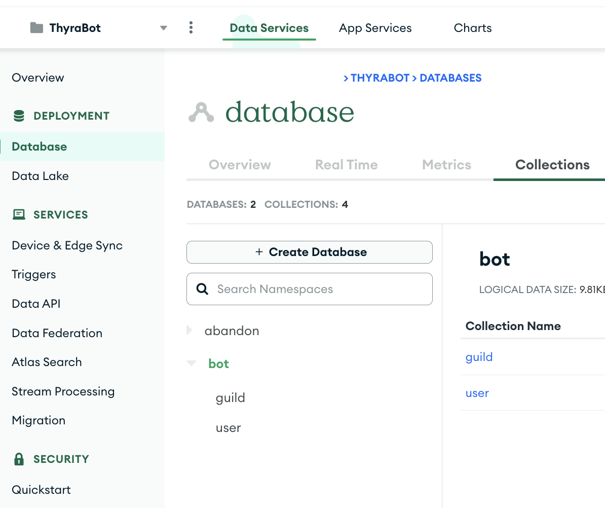
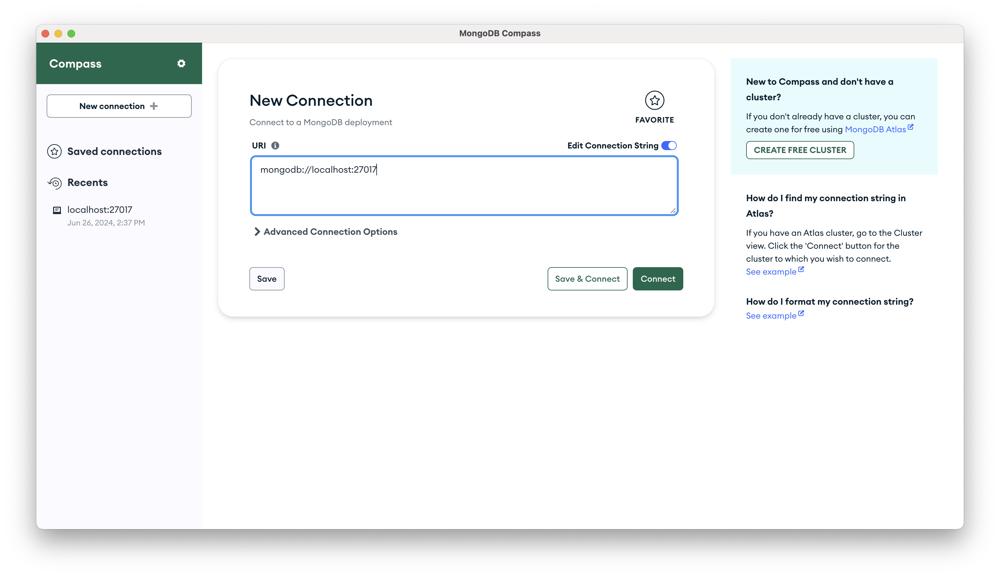
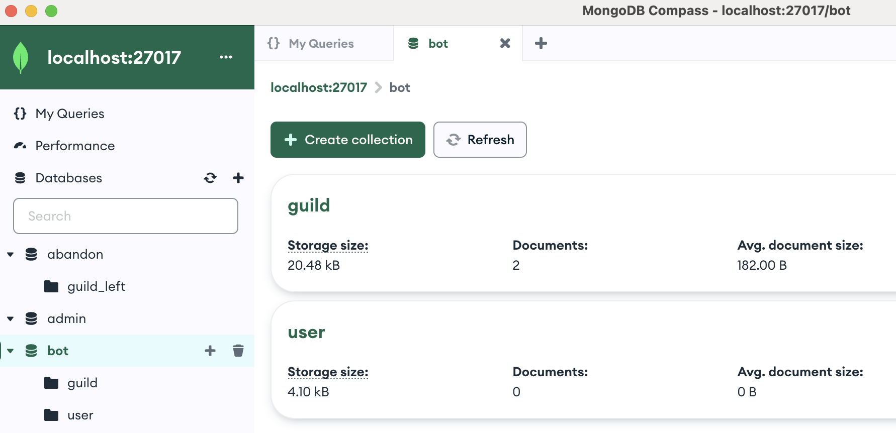

# Host MongoDB

You can [host MongoDB yourself](#self-hosting), but we recommend using [MongoDB Atlas](#mongodb-atlas). They offer a free tier for light usage and make it easy to extend if needed.

## MongoDB Atlas

1. Follow the [MongoDB Atlas Official Tutorial](https://www.mongodb.com/resources/products/platform/mongodb-atlas-tutorial) to create your account, first Project and first Cluster (M0 Cluster for free tier). 
   
2. Follow the connection guild to set security permission, then select *Connect to your application > Drivers* in step 1.



3. **Copy the connection string** provided by MongoDB Atlas below in step 2. It should start with `mongodb+srv://...`.



4. Create two *Databases* under the Cluster: 
   - `bot`: to store data about servers being served by the bot
     - Create two *Collections* named `guild` and `user` under this Database.
   - `abandon`: to store data about servers that are no longer being served, for example, when the bot is removed from a server, its data would be archived into this Database.
     -  Create one *Collection* named `guild_left` under this Database.
  - The names of the Database and Collections can be anything you want, but remember to replace their names into `.env` file later.



## Self Hosting

1. Based on your OS, following the [MongoDB Official Tutorial](https://www.mongodb.com/docs/manual/installation/) to download the MongoDB Community Edition. For example, if you run on macOS:

```
brew tap mongodb/brew
brew update
brew install mongodb-community@7.0
```

2. Run MongoDB in local server.

```
# To run MongoDB (i.e. the mongod process) as a macOS service, run:
brew services start mongodb-community@7.0

# To verify that MongoDB is running
# It should show 'mongodb-community started'
brew services list

# To stop a mongod running as a macOS service, use the following command as needed:
brew services stop mongodb-community@7.0
```

3. *(Optional, but Recommended if you prefer to use GUI tool)* Follow [Tutorial](https://www.mongodb.com/docs/compass/master/install/), download and install [MongoDB Compass GUI](https://www.mongodb.com/try/download/compass).

4. Make sure that MongoDB is running, open MongoDB Compass GUI and make a new connection to localhost.



5. Copy localhost URI as connection string (it should start with `mongodb://localhost...`) to `.env` file.

6. Create two *Databases*: 
   - `bot`: to store data about servers being served by the bot
     - Create two *Collections* named `guild` and `user` under this Database.
   - `abandon`: to store data about servers that are no longer being served, for example, when the bot is removed from a server, its data would be archived into this Database.
     -  Create one *Collection* named `guild_left` under this Database.
  - The names of the Database and Collections can be anything you want, but remember to replace their names into `.env` file later.


