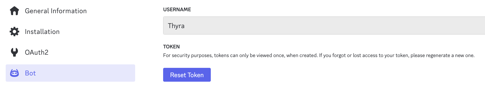
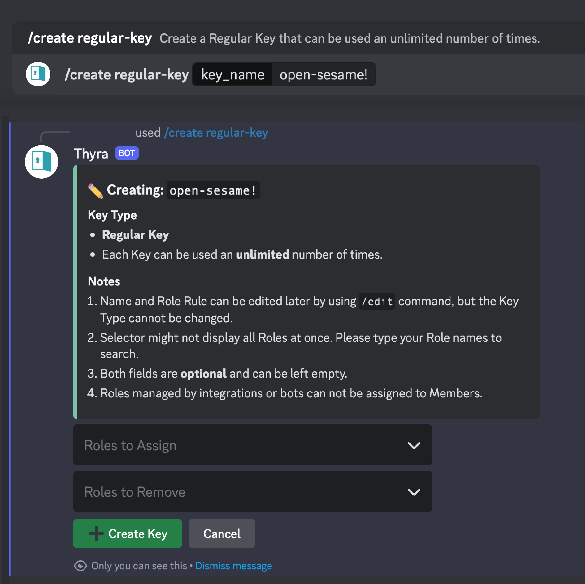
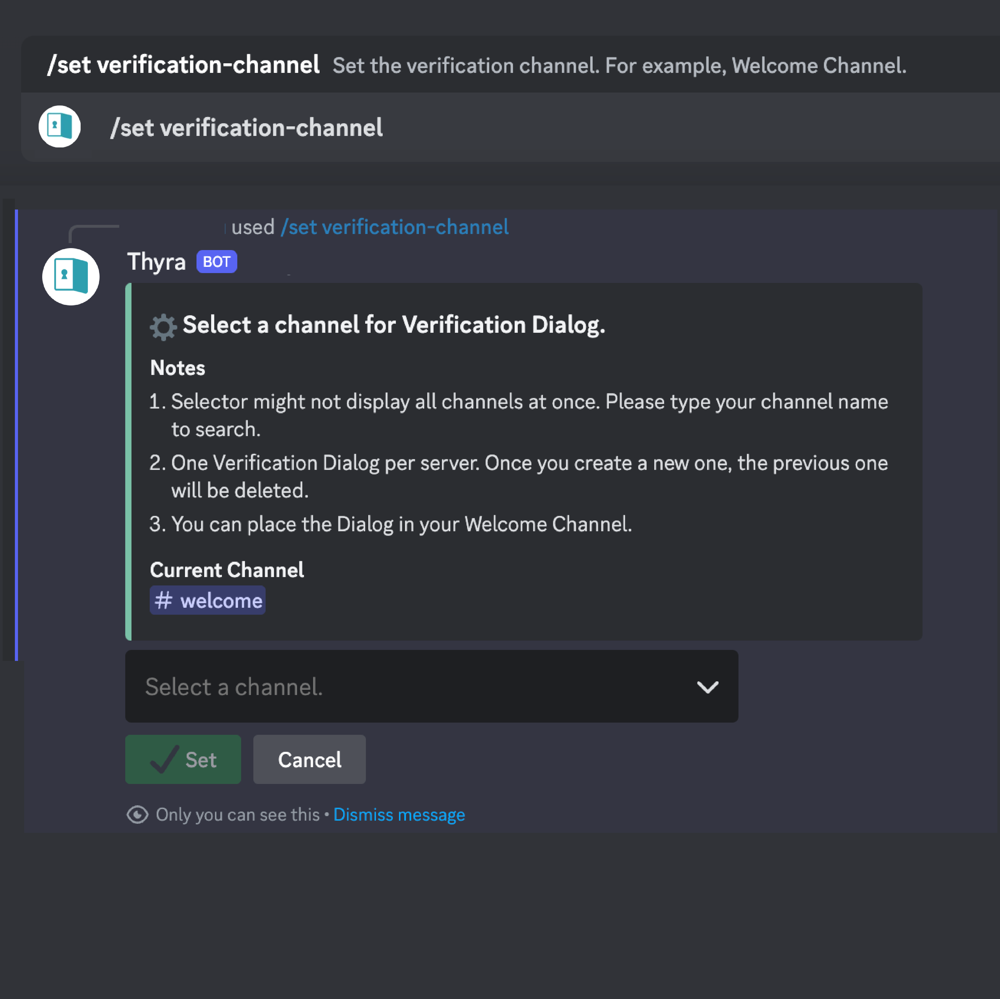
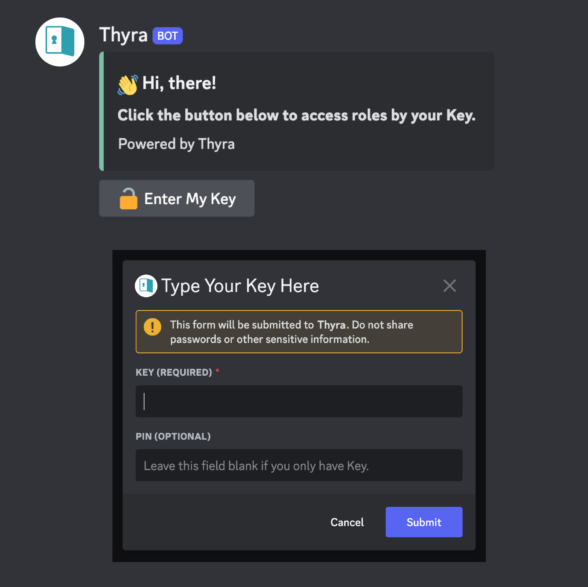
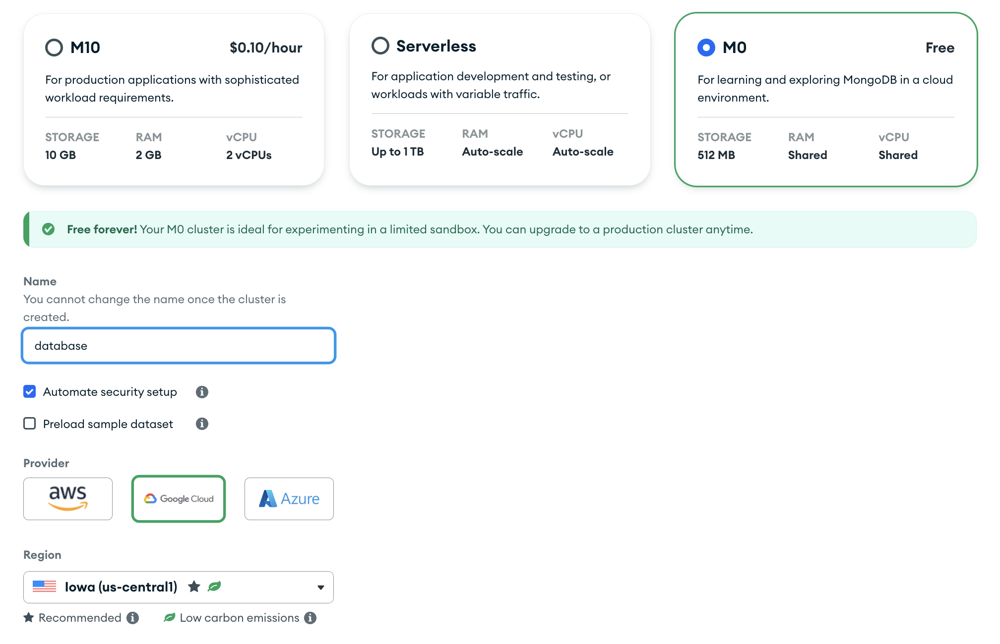
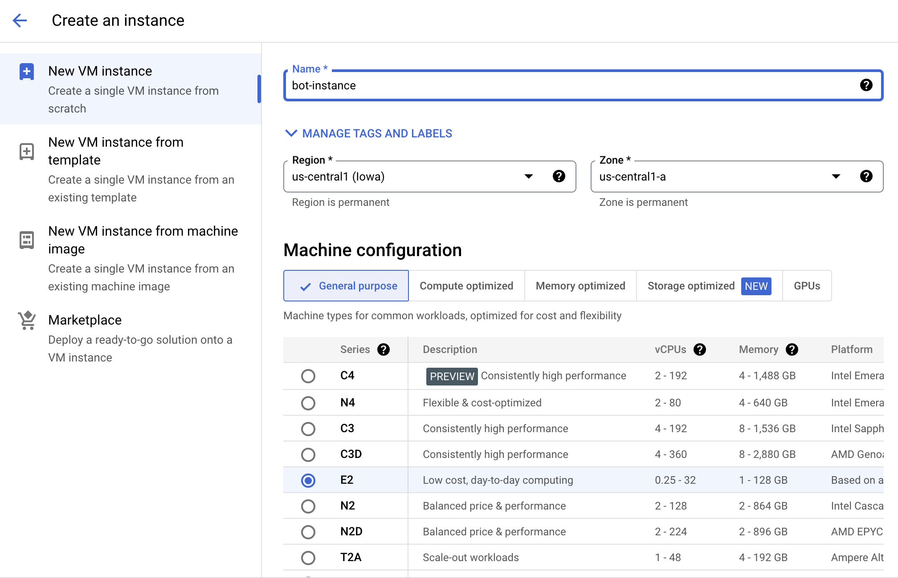

<div align="center">

# Thyra Discord Bot

## Key in, Role on. Your Discord Server Gatekeeper.

     
 


[🔗 View Thyra Official Website Here 🔗](https://thyra.pages.dev/)

Let server members unlock roles based on the Key and PIN they input. 

Track the origins of members by Key and One-Time PINs.

</div>

## Introduction 

Thyra can assist your server in automatically assigning or removing roles to members based on unique Keys.

You can restrict access to certain private channels and create a Key for specific roles within your server. Once members input the Key, they can access the roles and channels you've designated for them.

## Features

- No need for an additional Dashboard. Admin can create, edit, list, and remove Keys in Discord easily by Slash Commands.
- Verify in Discord directly, without opening a browser or redirecting to an external website.
- Generate multiple One-Time PINs for a Key, which allowing admin to identify the member who use it.
- Track which and when Keys members have used, and the relationship between PIN and member.
- Three different types of Keys. Choose the appropriate type based on your needs: 
    - Regular Keys with no usage limits: for basic human verification or to determine how users found the server (like UTM we used behind url).
    - Limited Keys with usage limits: to restrict the number of people who can obtain certain roles.
    - Protected Keys requiring an additional One-Time PIN for enhanced security: for stronger privacy protection and to track individual user sources (each PIN corresponds to a single user).


## Getting Started

### Prerequisites

1. Get your Discord Bot Token
    - Follow the [Discord Official Tutorial](https://discord.com/developers/docs/quick-start/getting-started). Go to [Discord Developer Portal](https://discord.com/developers/docs/getting-started) to create a new application.
    - Enable *SERVER MEMBERS INTENT* and *MESSAGE CONTENT INTENT* under *Bot > Privileged Gateway Intents*.
    - Navigate to *OAuth2 > OAuth2 URL Generator*, select *SCOPES: BOT*, and *BOT PERMISSIONS > Administrator*. You will get a link; click it to open and invite the bot to join your server.
    - **Copy your Bot token** from *Bot > TOKEN*.
    - 

2. Create Mongodb database
   - Follow [HERE](MongoDB_README.md) to create a new Mongodb database.

3. *(Optional)* Create virtual environment for Python
   - There are many libraries named `discord` (For example, [discord.py](https://discordpy.readthedocs.io/en/stable/) and [Pycord](https://docs.pycord.dev/en/stable/index.html)), so to prevent importing conflicts, it's better to create a clean virtual environment first.
   - Here is a simple method to create a virtual environment named `venv`:

```
python -m venv venv

# Windows
venv\Scripts\activate

# macOS/Linux
source venv/bin/activate
```

4. Install requirements.
    - `py-cord`: Python wrapper for the Discord API.
    - `pymongo`: Python driver for MongoDB.
    - `python-dotenv`: Library to read environment variables from a `.env` file.
    - `fuzzywuzzy`: Library for fuzzy string matching. To handle tha autocomplete candidates about keyword when user typing.
    - `python-Levenshtein`: Dependency of `fuzzyword`.
  

```
pip install -r requirements.txt
```

5. Rename or Copy `.env.sample` to `.env`, then replace the values in the file.
    - `DISCORD_TOKEN`: Discord bot token you copied from Step 1.
    - `MONGODB_URL`: MongoDB connection string you copied from Step 2.
    - `DATABASE_NAME`: Default is `bot`.
    - `GUILD_COLLECTION_NAME`: Default is `guild`.
    - `USER_COLLECTION_NAME`: Default is `user`.

6. Run Bot!

```
python main.py
```

## Bot Settings

1. Move Thyra's role **HIGHER** than the other roles you want to set in the server Role list (*Discord > Server Settings > Roles*).
    - Make sure the Thyra's role is positioned higher in the role hierarchy than the roles it manages. 
    - If not, even if a user successfully verifies their role with the Key, they will not be able to assign or remove any roles because the Thyra's role priority is lower than other roles.
2. Use `/create regular-key <key_name>` to create a Regular Key.
3. Use `/set verification-channel` to set the verification channel, such as server's Welcome Channel.
4. Share the Key with others. That's all!

|Create a Key | Set Verification Ch.| Done!| 
|:---:|:---:|:---:|
||||

## Bot Commands (Admin only, Ephemeral responses)

- Create a Key
  - `/create regular-key <key_name>`
  - `/create limited-key <key_name> <max_used>`
  - `/create protected-key <key_name> <num_otp>`

- Edit a Key (Rename, edit Role Rules, etc.)
  - `/edit <key_name>`
  
- Show Key details, One-Time PINs, and Member
  - `/detail key <key_name>`: Also list the One-Time PINs for Protected Key.
  - `/detail member <member_id>`: Only server member available.
  - `/detail pin <key_name> <pin>`: Only Protected Key available.

- Remove a Key
  - `/remove key <key_name>`
  - `/remove all`

- List Keys
  - `/list list`
  - `/list regular-keys`
  - `/list limited-keys`
  - `/list protected-keys`

- Set Channels and time zone
  - `/set verification-channel`: Set the verification channel. For example, Welcome Channel.
  - `/set dashboard-channel`: Set the dashboard and logging channel.
  - `/set timezone <timezone>`: Set the log time zone to display local time in embeds. Default time zone is UTC.

## About Response Latency

Discord commands have a 3-second response time limit. If the response time exceeds this limit, a TimeoutException will occur. Therefore, we strongly recommend placing the database and bot server in the same area or nearby to minimize latency.

## How to Host It for Free on Cloud?

Here are some free cloud server options:

- [Amazon Web Services (AWS) EC2](https://aws.amazon.com/ec2/): 750 hours per month of t2.micro or t3.micro (first 12mo). 100GB egress per month
- [Google Cloud Platform (GCP) Compute Engine](https://cloud.google.com/free/docs/free-cloud-features#compute):  1 non-preemptible e2-micro, 30GB HDD, 5GB snapshot storage (restricted to certain regions), 1 GB network egress from North America to all region destinations (excluding China and Australia) per month.
- ...[more](https://github.com/ripienaar/free-for-dev?tab=readme-ov-file#major-cloud-providers)

For example, you can use a M0 Cluster located in GCP/Iowa (us-central1) in MongoDB Atlas.



And host the bot on GCP/Iowa (us-central1), for both free tier usage and the shortest latency.



Remember to select a nearby location for both your database hosting and bot hosting to minimize latency and improve performance.

## Inspiration

The inspiration for this project came from organizing a Learning Discord Guild where members come from different courses.

We have a public channel that everyone can see (similar to a Lobby in an MMO) and course-specific channels that only course members can access. These course-specific channels share class schedules, learning materials, and allow members to submit their assignments.

Reason not to use Autorole is that anyone can click the emoji, and we cannot ensure users will only click the designated emoji. They might click other emojis that grant access to channels they should not see.

Discord currently allows us to differentiate user sources through different invite links, but invite links are not exclusive or limited. Anyone can join through the link, and they don't receive a role upon joining. And even, what if the members are already in the server?

Therefore, I needed a bot that functions like a "Gatekeeper" to guide members on which channels they can access. In other words, this Gatekeeper can assign or remove roles for different users.

While making this bot, I thought the idea is similar to an Urchin Tracking Module (UTM) link, where users must enter certain keys to access channels. This allows us to track how they found out about the server.

By combining keys with PINs, we can distribute different PINs to different students and track who each user is, linking their identity outside of Discord with their identity inside Discord. This could be useful for marketing and management.

The bot simplifies everything: the admin does not need to manually assign roles to each member. They just need to set up the keys, and the bot will handle the assignment, verification, and tracking.

*Thyra* comes from the Ancient Greek word *θύρα* *(thýra)*, which means *the door or gate*.

## Contribute

Any contributions you make are greatly appreciated!

If you have a suggestion that would make this better, please fork the repo and create a pull request. 

1. Fork the Project
2. Create your Feature Branch (`git checkout -b feature/your_feature`)
3. Commit your Changes (`git commit -m 'add_some_your_feature'`)
4. Push to the Branch (`git push origin feature/your_feature`)
5. Open a PR

## Contact Me & Support Thyra

[](https://buymeacoffee.com/chingru)

- 👋｜ChingRu ([github@rutopio](https://github.com/rutopio)) 
- ✉️｜contact [AT] chingru.me
- 👤｜[LinkedIn](https://www.linkedin.com/in/ching-ru/)
- 🧋｜If you like my projects, you can [Buy Me a Bubble Tea](https://buymeacoffee.com/chingru)!

And don't forget to give the project a **STAR**! Thanks you!

## Reference

- [Pycord](https://docs.pycord.dev/en/stable/index.html)
- [Discord Developer Platform](https://discord.com/developers/docs/intro)
- [NongoDB Atlas](https://www.mongodb.com/products/platform/atlas-database)
- [free-for.dev](https://github.com/ripienaar/free-for-dev)

## License

Copyright (c) 2024 ChingRu ([github@rutopio](https://github.com/rutopio))

Distributed under the MIT License. See [LICENSE](LICENSE) file for more information.


